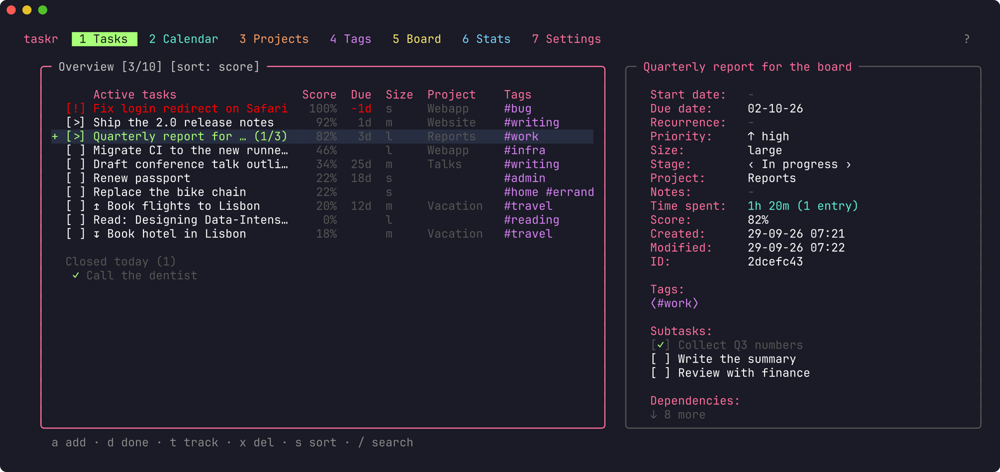
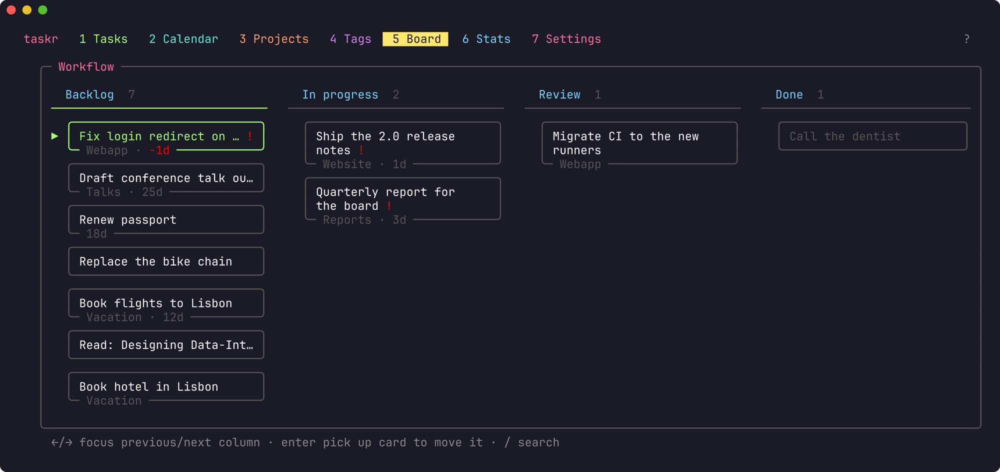

# taskr

A keyboard-driven task manager for the terminal that tells you what to do next.

taskr runs on Linux, macOS and Windows and keeps everything in a local file.
It can sync between your machines through a small server you run yourself.
No account, no cloud service.

## What it does

- **Ranks your tasks.** Deadline, priority, recent work, size and age decide
  the order, and a task that blocks something urgent rises with it. Press `w`
  to see why a task ranks where it does.
- **Holds the details.** Due and start dates, priority, size, tags, projects,
  subtasks, dependencies, comments, notes and repeating tasks.
- **Adds in one line.** `Buy milk #shopping due:friday p:high @home`
- **Shows the same tasks five ways:** a list, a calendar with tracked time,
  projects with a timeline, tags, and a kanban board. Plus a stats page.
- **Tracks time.** Start and stop a timer on a task with `t`.
- **Reminds you daily** with a desktop notification of what's due and overdue.
- **Syncs** between computers, **undoes** every change, and has a **command
  palette** (`ctrl+k`) and a **command line** for scripting.
- **Speaks English, Danish and German**, with themes and rebindable keys.

## Install

| | |
|---|---|
| macOS | `brew install iliorn/tap/taskr` |
| Windows | `scoop install https://github.com/Iliorn/taskr/releases/latest/download/taskr.json` |
| Arch Linux | `yay -S taskr-bin` |
| Linux / Windows binary | [Releases](https://github.com/iliorn/taskr/releases) |
| Anywhere Go runs | `go install github.com/Iliorn/taskr@latest` |

taskr updates itself from Settings → "Update to latest release".
[docs/install.md](docs/install.md) covers building from source and verifying
a download.

## Getting started

Run `taskr`.

| Key | Action |
|-----|--------|
| `a` | Add task |
| `d` | Done |
| `enter` | Details: comments, subtasks, dependencies, notes |
| `t` | Start/stop the timer |
| `D` | Set the due date |
| `/` | Search |
| `f` | Focus on today and overdue |
| `u` | Undo |
| `tab` / `1–7` | Switch tab |
| `?` | Every key |
| `ctrl+k` | Find any action by name |

`#tag`, `@project`, `due:friday`, `p:high` and `s:l` fill in a new task, and
the same words search: `/` then `@work overdue` shows your overdue work tasks.
Dates can be `today`, `tomorrow`, `monday`, `+3d`, `-2d`, `15-06-25` and more.

## Learn more

- [Using taskr](docs/guide.md): every tab, search, the board, reminders and custom keys
- [Command line](docs/cli.md): `taskr add`, `list`, `done`, JSON output, export and import
- [Sync between devices](docs/sync.md): running a server and connecting your machines
- [Files and troubleshooting](docs/troubleshooting.md): where data lives, backups, crashes
- [Changelog](CHANGELOG.md)

## Contributing

[CONTRIBUTING.md](CONTRIBUTING.md) covers building and testing, and
[ARCHITECTURE.md](ARCHITECTURE.md) how taskr is put together. Security issues
go through [SECURITY.md](SECURITY.md).

## License

MIT
